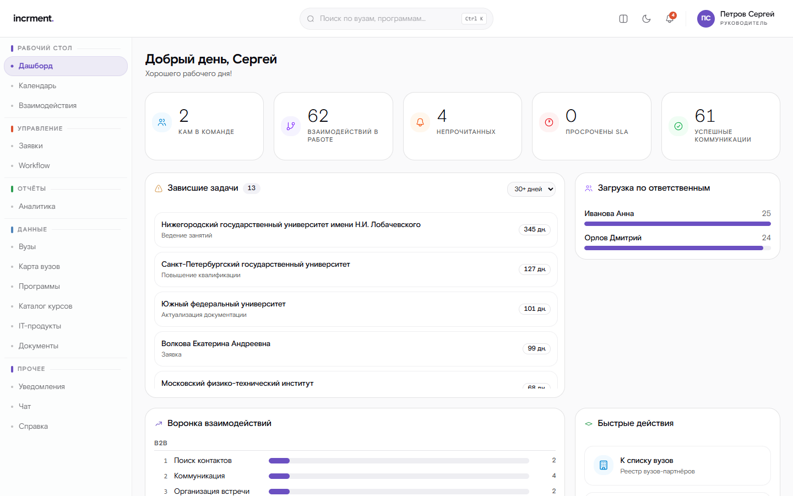
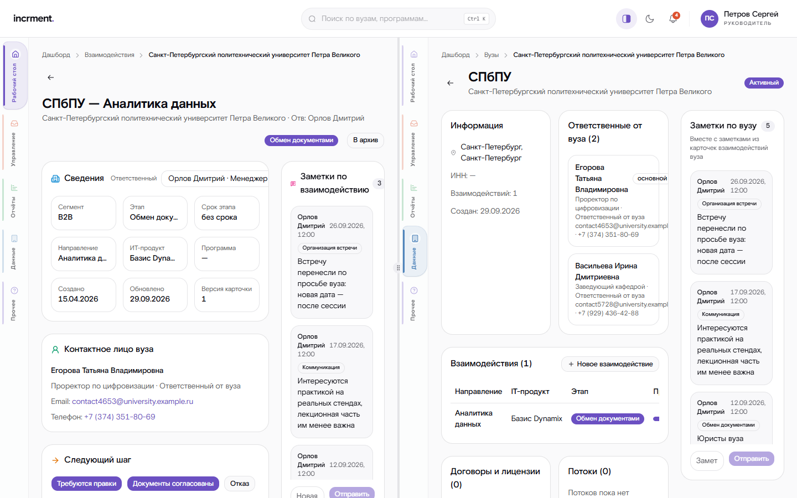
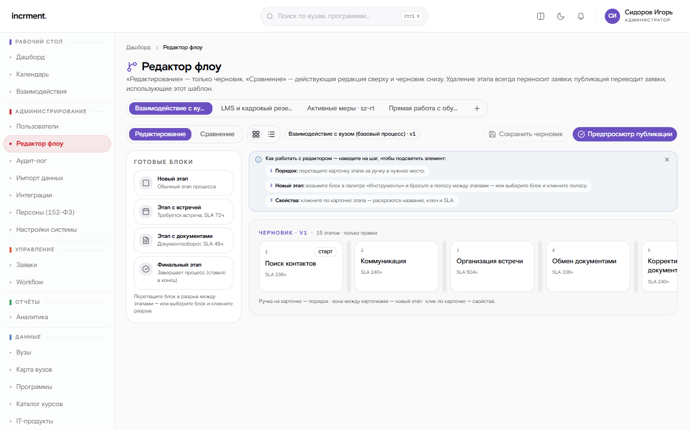
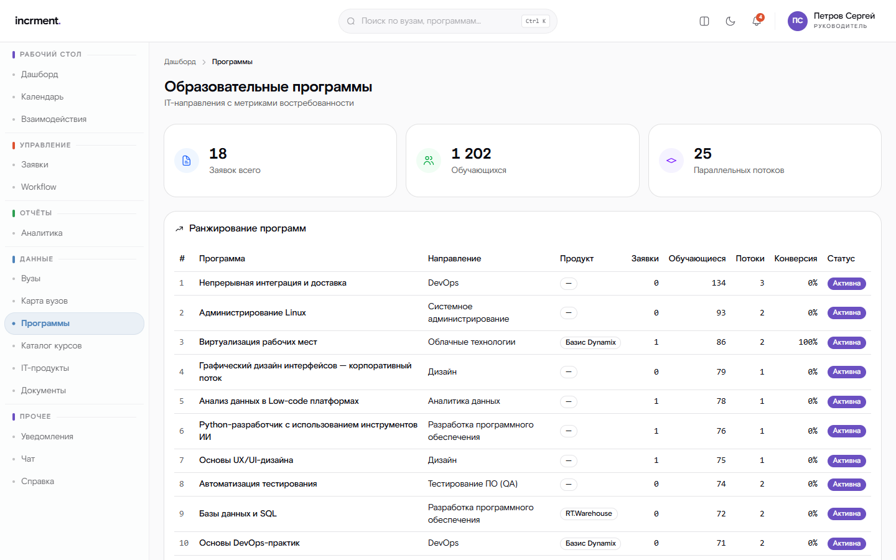
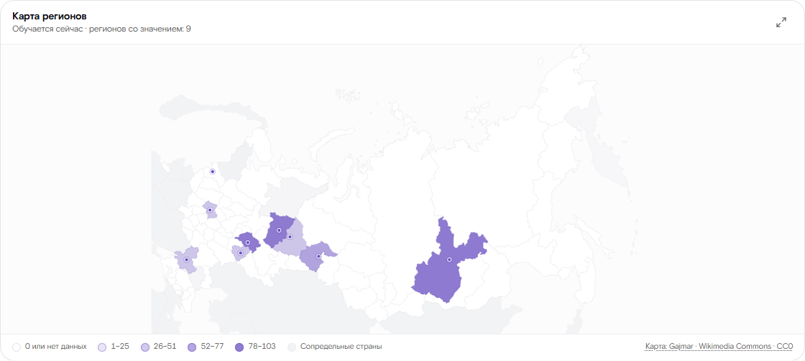
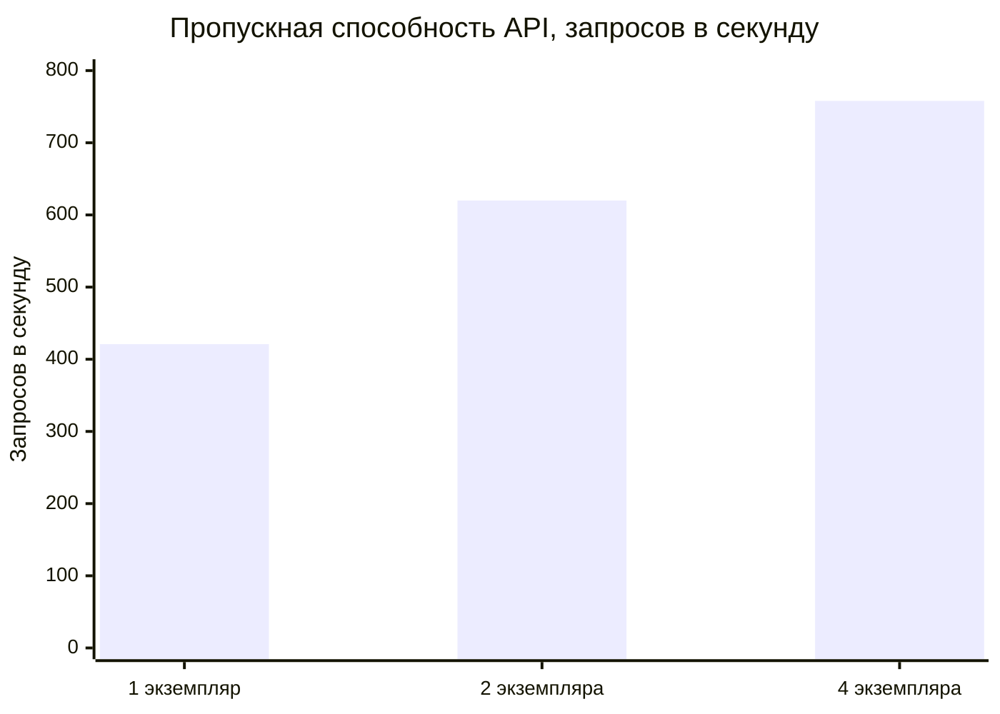

# incrment · CRM «ИТ Школа РТК»

Система контроля и обработки статистических данных по обучению студентов вузов
и школ по ИТ-направлениям.

CRM ведёт каждое взаимодействие с вузом по настраиваемому процессу, от поиска
контактного лица до сопровождения внедрения, и не даёт шагам потеряться.
Она ранжирует ИТ-программы по востребованности: заявки, обучающиеся, параллельные
потоки. Отчёты система собирает в xlsx, xls, pdf и csv. Прямые продажи
обучения идут отдельным процессом: оплата приходит с сайта, слушатели
выгружаются в LMS.

**[Стенд](https://incrment.ru)** ·
[Руководство пользователя](docs/guides/user-guide.md) ·
[Руководство администратора](docs/guides/admin-guide.md) ·
[Нагрузочное тестирование](docs/load-testing.md) ·
[Защита информации](docs/security-compliance.md) ·
[Контракт API](openapi.json)



---

## Что умеет система

- **Взаимодействия по процессу.** Два процесса: работа с вузами (B2B) и прямые
  продажи (B2C). Заявки видны доской по этапам. В карточке заявки — путь по
  этапам, переходы с условиями («нужен комментарий», «приложите документ»),
  заметки и файлы к этапу, встречи с представителями вуза, задачи и полная
  история.
- **Редактор процесса.** Администратор собирает следующую редакцию схемы. До
  публикации он видит, какие заявки и куда переедут, после публикации все
  заявки идут по новой схеме. Разные версии маршрута не сосуществуют — так
  просил заказчик.
- **Ранжирование программ** по числу заявок, обучающихся сейчас и параллельных
  потоков. Каталог курсов объединяет программы всех образовательных проектов
  РТК.
- **Реестр вузов.** На странице вуза — ответственные от вуза, договоры
  с лицензиями, учебные потоки и заметки по вузу.
- **Отчёты и аналитика.** Отчёт строится с отбором и выбором колонок. Большой
  отчёт формируется в фоне и сообщает о готовности. Есть карта регионов,
  воронка, выгрузка диаграмм в PNG и PDF.
- **Загрузка из Excel.** Принимаются xlsx и книги 97-2003. Колонки
  сопоставляются, ошибочные строки разбираются, до подтверждения данные
  не меняются.
- **Обмен с LMS и сайтом** в обе стороны: подписанные события, журнал исходящих
  событий, оплаты с сайта и выгрузка слушателей в LMS по шаблону заказчика.
- **Календарь и уведомления.** В календаре задачи, поручения руководителя,
  сроки этапов и встречи. Уведомления приходят в систему, Telegram, MAX или на
  почту. О зависших заявках система напоминает сама.
- **Роли и видимость.** Роли — КАМ, руководитель и администратор. Видимость
  дополнительно ограничивается по вузам, направлениям, продуктам и регионам.
- **Защита информации** по 152-ФЗ и приказу ФСТЭК № 117. Вход через Keycloak,
  журнал аудита с хэш-цепочкой, маскирование персональных данных, антивирусная
  проверка загрузок.
- **Разделение экрана.** Две страницы открываются рядом, например карточка
  заявки и страница вуза. У каждой панели своё меню, ширину панелей можно
  менять.
- **Встроенная справка** со снимками экрана — раздел «Справка» в меню.

<table>
<tr>
<td width="50%"><br><sub>Разделение экрана: карточка взаимодействия и страница вуза рядом</sub></td>
<td width="50%"><br><sub>Редактор процесса: этапы, палитра блоков, предпросмотр публикации</sub></td>
</tr>
<tr>
<td width="50%"><br><sub>Ранжирование программ по востребованности</sub></td>
<td width="50%"><br><sub>Региональная аналитика: карта по числу обучающихся</sub></td>
</tr>
</table>

---

## Производительность

Замеры сделаны на базе в **50 000 заявок** — это на порядок больше ожидаемого
объёма. Режим production; приложение, база и генератор нагрузки работают
на одной машине с 8 ядрами. Сессии обращаются к API без пауз, поэтому одна
сессия нагружает систему сильнее живого пользователя.

| Требование | Результат |
|---|---|
| Отклик не более 1 с при 50 пользователях (ТЗ) | худший p95 — **232 мс** на одном экземпляре API |
| 300 и более пользователей (сессия вопросов и ответов) | 300 сессий: худший p95 — **785 мс** на четырёх экземплярах |
| Не менее 10 параллельных отчётов (ТЗ) | **62** готовых отчёта в минуту на четырёх фоновых процессах |
| Отчёт по всей базе | 50 000 строк в xlsx — **8,4 с** до готового файла |
| Вход в интерфейс | КАМ — **0,13 с**, администратор со всеми 50 000 заявками — **1,0 с** |



Во всех прогонах ни одной ошибки, журнал аудита после нагрузки цел. Методика,
разбор по каждому обращению, запись, отчёты и порядок масштабирования —
в [docs/load-testing.md](docs/load-testing.md).

---

## Попробовать на стенде

Стенд: **https://incrment.ru**. Вход — через Keycloak учётными записями ниже.
Они заведены демонстрационным наполнением и существуют только на стенде.

| Логин | Пароль | Роль | Что видно |
|---|---|---|---|
| `kam.ivanova` | `Kam#2026demo` | Менеджер (КАМ) | Свои взаимодействия |
| `kam.orlov` | `Kam#2026demo` | Менеджер (КАМ) | Свои взаимодействия |
| `manager.petrov` | `Mgr#2026demo` | Руководитель | Свои и подчинённых, переназначение ответственного |
| `admin.sidorov` | `Adm#2026demo` | Администратор | Всё: процессы, права, уведомления, обмен, журнал действий |

Стоит войти каждой ролью по очереди: разделы и доступные действия у ролей
заметно различаются, и ограничение видимости данных проверяется именно так.

---

## Быстрый старт

### Полный стек в Docker

```bash
cp .env.example .env
docker compose --profile full up -d
```

Стек поднимается в продуктовой конфигурации: `docker-compose.yml` задаёт процессам
`api` и `worker` значение `NODE_ENV=production`. В этом режиме проверка
конфигурации при старте требует включённого антивируса (`CLAMAV_ENABLED=true`,
контейнер входит в профиль `full`) и пароля к документации (`SWAGGER_PASSWORD`).
В `.env.example` оба значения уже заданы. С пустым паролем или выключенным
антивирусом процесс намеренно падает, а не запускается в ослабленном виде.

Через минуту будут доступны:

| Сервис | Адрес | Учётные данные |
|---|---|---|
| Swagger UI | http://localhost:3000/api/docs | `docs` / `docs` (`SWAGGER_USER` / `SWAGGER_PASSWORD`) |
| OpenAPI (JSON) | http://localhost:3000/api/docs-json | те же |
| Keycloak | http://localhost:8080 | `admin` / `admin` |
| MinIO Console | http://localhost:9001 | `minioadmin` / `minioadmin` |
| Grafana | http://localhost:3001 | `admin` / `admin` |

**Режим разработки.** Тот же стек, но с послаблениями для ручных проверок:
обход аутентификации вместо Keycloak, без антивируса, подробные логи.

```bash
docker compose -f docker-compose.yml -f docker-compose.dev.yml --profile app up -d
```

Перекрытие [docker-compose.dev.yml](docker-compose.dev.yml) меняет только `NODE_ENV`,
`AUTH_DEV_BYPASS`, антивирус и уровень логов. Остальная конфигурация общая,
поэтому режимы различаются только этими параметрами. Чтобы вернуться
к продуктовому режиму, запустите стек без второго файла. Профиль здесь `app`,
а не `full`: контейнер ClamAV в режиме разработки не нужен. Роль фиктивного
пользователя задаёт переменная `AUTH_DEV_BYPASS_ROLE` (`USER`, `MANAGER`,
`ADMIN`).

### Инфраструктура в Docker, приложение локально

Для разработки: перезапуск кода не требует пересборки образа.

```bash
cp .env.example .env
docker compose up -d postgres redis minio minio-init keycloak

npm install
npx prisma migrate deploy
npm run db:seed

npm run start:dev      # процесс api
npm run worker:dev     # процесс worker (в отдельном терминале)
```

Локально действует `NODE_ENV=development` из `.env`, поэтому послабления
разрешены. Антивирус при этом остаётся включённым (`CLAMAV_ENABLED=true`).
Поднимите контейнер командой `docker compose --profile security up -d clamav`
или поставьте в `.env` `CLAMAV_ENABLED=false`. Без демона ClamAV загрузка файлов
отклоняется.

### Интерфейс

```bash
npm --prefix web ci
cp web/.env.example web/.env  # бэкенд и Keycloak из docker compose
npm --prefix web run dev      # http://localhost:5173
```

С `web/.env` все разделы берут данные из API, вход идёт через Keycloak
(Authorization Code + PKCE). Так же собирается и стенд. Без `.env` интерфейс
работает автономно: демо-вход и данные из моков. Порт 5173 зафиксирован,
он прописан в `redirect_uri` клиента `crm-frontend`. Запросы идут через прокси
дев-сервера, поэтому CORS не участвует. Подробности — в [web/README.md](web/README.md).

### Проверка работоспособности

```bash
curl http://localhost:3000/health/ready
```

- `/health/live` — жив ли процесс. Внешние зависимости не проверяются, иначе
  кратковременная недоступность БД перезапускала бы исправные контейнеры.
- `/health/ready` — готов ли экземпляр обслуживать запросы. Если PostgreSQL
  недоступен, ответ `down`, и экземпляр выводится из балансировки. Если
  недоступен Redis, ответ `degraded` при HTTP 200: кэш и очереди не работают,
  но данные по-прежнему читаются. Помечать это состояние как `down` нельзя:
  при падении единственного Redis из ротации разом вышли бы все экземпляры.
- `/metrics` — метрики Prometheus. **Порт должен быть закрыт от внешней сети.**

---

## Архитектура

**Модульный монолит, два процесса из одного образа.** При нагрузке из ТЗ
микросервисы добавили бы сетевые задержки и распределённые транзакции
без выгоды. Поэтому код единый, но границы модулей позволяют
выделить любой из них позже.

- `api` — HTTP и WebSocket, запускается из `dist/main.js`. Состояния в памяти
  процесса нет, поэтому экземпляры ставятся за балансировщик.
- `worker` — фоновые задачи: отчёты, импорт, обмен, рассылки. Запускается
  из `dist/worker.js` и масштабируется отдельно от API.

**Тяжёлые документы формирует `worker`.** Рендеринг большого XLSX или PDF
на секунды занимает процессор и остановил бы обслуживание всех остальных
пользователей. Поэтому API сразу отдаёт только небольшие отчёты, до 2 000 строк,
а крупные и все PDF уходят в очередь:

```bash
docker compose up -d --scale worker=3
```

| Слой | Технология | Почему |
|---|---|---|
| Среда исполнения | Node.js 24 LTS, TypeScript 6 (strict) | Актуальный LTS, строгая типизация |
| Фреймворк | NestJS 12 + Fastify | Модульность и DI; сериализация ответов по схеме заметно быстрее `JSON.stringify` |
| База данных | PostgreSQL 17 | Требование ТЗ. `pg_trgm` для поиска подстрокой, частичные индексы, advisory-блокировки |
| ORM (запись) | Prisma 7 | Миграции, схема как документация |
| Запросы (чтение) | Kysely | Типобезопасная сборка динамического SQL для конструктора отчётов |
| Кэш и очереди | Redis 7 + BullMQ | Кэш, фоновые задачи, дедупликация отчётов, общий счётчик ограничения частоты |
| Хранилище файлов | MinIO (S3 API) | Вложения и готовые отчёты, развёртывание на своих серверах |
| Аутентификация | Keycloak 26 (OIDC) | Требование ТЗ. Authorization Code + PKCE |
| Авторизация | CASL | Ролевая модель и построчное ограничение видимости данных |
| Документы | ExcelJS (потоковый), SheetJS, pdfmake, ECharts SSR | Потоковая запись xlsx любого объёма. SheetJS читает и пишет книги 97-2003 |
| Интерфейс | React 19, Vite 8, Tailwind CSS 4, zustand | Статика, которую отдаёт Caddy с того же домена, что и API |
| Наблюдаемость | pino, Prometheus, Grafana | Журналы без ПДн, метрики времени отклика |

Полный перечень библиотек формируется автоматически: `npm run sbom` (CycloneDX).

SheetJS устанавливается с официального источника разработчика, а не из npm:
в реестре npm последняя версия — 0.18.5, и к ней выпущены уведомления
об уязвимостях. Именно через разбор загружаемых файлов в систему попадают
недоверенные данные. Сборка требует доступа к `cdn.sheetjs.com`.

Оба формата Excel поддерживаются полностью, на чтение и на выгрузку: Office
Open XML и книги 97-2003 (BIFF8). Формат определяется по сигнатуре, а не по
расширению: выгрузки из старых систем часто приходят с неправильным расширением.

---

## Документация

| Документ | О чём |
|---|---|
| [Руководство пользователя](docs/guides/user-guide.md) | Работа КАМа и руководителя: взаимодействия, заметки, встречи, календарь, отчёты. Встроено в систему |
| [Руководство администратора](docs/guides/admin-guide.md) | Процессы, пользователи и права, уведомления, обмен, журнал действий. Встроено в систему |
| [Нагрузочное тестирование](docs/load-testing.md) | Замеры на 50 000 заявок, отчёты, масштабирование, воспроизведение |
| [Защита информации](docs/security-compliance.md) | Сопоставление требований 152-ФЗ и приказа ФСТЭК № 117 с реализацией |
| [Разбор Q&A-сессии](docs/qa-session-findings.md) | Ответы заказчика и решения, принятые по каждому из них |
| [Пользовательские пути](docs/frontend-user-journeys.md) | Роли, жизненный цикл заявки, маршруты API для каждого шага |
| [Стенд](deploy/README.md) | Конвейер развёртывания, подготовка сервера, диагностика |
| [Keycloak](keycloak/README.md) · [Имитатор внешних систем](mock-external/README.md) · [Интерфейс](web/README.md) | Realm и клиенты; LMS и сайт на время без контракта; устройство фронтенда |

Встроенные руководства открываются в самой системе (раздел «Справка»)
и через API: `GET /api/v1/guides` возвращает оглавление, `GET /api/v1/guides/{slug}` —
раздел. Руководство администратора пользователям без этой роли не показывается.

---

## Контракт API

Контракт API — самостоятельная часть продукта: интерфейс разрабатывала отдельная
команда и опиралась только на него.

- **Формат ошибок** — RFC 9457 (Problem Details). В каждом ответе есть
  стабильный код вида `CRM-<ДОМЕН>-<НОМЕР>`. Реагировать нужно на поле `code`,
  а не на текст сообщения: текст может измениться, код — нет.
- **Идемпотентность** — заголовок `Idempotency-Key` на изменяющих запросах.
  Ключ привязан к методу, адресу и телу, захват ключа атомарен. Повторная
  отправка возвращает первоначальный результат и не создаёт дубликат.
- **Конкурентные изменения** — `ETag` / `If-Match` при смене статуса: два
  менеджера не затрут правки друг друга молча.
- **Длительные операции** — большой отчёт возвращает `202 Accepted`
  с идентификатором задачи, прогресс приходит по WebSocket.

---

## Сегменты, процессы и обмен с внешними системами

**Два сегмента работы.** Взаимодействие с вузом (B2B) и прямая работа с обучающимся
или организацией (B2C) идут по разным маршрутам. Этапы у них разные, а контрагент
во втором случае — физическое или юридическое лицо, а не вуз. Сегмент — свойство
заявки: по нему выбирается процесс и разделяется отчётность. Ограничения
видимости по вузам и регионам к прямым продажам не применяются: вуза у таких
заявок нет, и безусловное условие скрыло бы их целиком.

**Процесс един для всех и не версионируется.** Администратор собирает черновик
следующей редакции, запрашивает предварительный просмотр и публикует её:

```
POST /api/v1/workflow/templates                       # черновик
GET  /api/v1/workflow/templates/{id}/publish/preview  # что изменится и кого затронет
POST /api/v1/workflow/templates/{id}/publish          # публикация
```

Публикация переводит на новую редакцию **все** текущие заявки сегмента: редакции
не сосуществуют. Заявки из удалённых статусов переносятся согласно `stateMapping`.
Предварительный просмотр сам предлагает соседний статус и показывает, сколько
заявок, заметок и файлов стоит в каждом исчезающем. Заметки и файлы этапа
переезжают вместе с заявкой и сохраняют прежнюю подпись этапа. Каждый перенос
попадает в журнал переходов, поэтому по карточке видно, что статус сменила
правка схемы, а не работа менеджера. Прошлые редакции остаются в таблице как
журнал изменений, но заявок на них нет. Правит процесс только администратор.

**Обмен двусторонний.** CRM забирает события LMS и сайта: синхронизирует их
по расписанию или вручную и принимает вызовы с подписью HMAC. В обратную
сторону CRM отправляет изменения по заявкам через журнал исходящих событий.
Событие пишется в одной транзакции с переходом, а доставляет его фоновый
процесс, поэтому состояние внешней системы не расходится с CRM.

Контракт внешних систем заказчик не передал, поэтому рядом работает
**имитатор** — отдельная служба на месте LMS и сайта. Она отдаёт события,
принимает состояние заявок и сама вызывает CRM подписанным запросом
([mock-external](mock-external/README.md)). Две системы — два порта, как
в реальном контуре с доступом «точка-точка». Обмен идёт по сети, а не через
внутренние заглушки. Когда контракт передадут, в настройках поменяются адреса,
а код останется прежним.

Событие внешней системы добавляется **в существующую заявку**, если она уже
заведена: запись на обучение и её завершение приходят разными сообщениями, но
относятся к одному обращению. Заявка опознаётся по идентификатору обращения,
а без него — по почте контрагента и направлению. В истории заявки видно, что
статус сменила внешняя система.

Контракт со стороны CRM опубликован по адресу
`GET /api/v1/integration/contracts/engagement.v1`: схема и пример сообщения,
включая ключи связи с записями БД и объектами в S3.

**Заявка сама напоминает о себе.** Если заявка остаётся в одном статусе дольше
заданного срока, уведомление получают ответственный и его руководитель. Срок
задаёт администратор в интерфейсе (`PUT /api/v1/notifications/settings`), а не
конфигурация развёртывания. Точного значения заказчик не назвал, ориентир —
одна-две недели. Повторного напоминания об одной и той же ситуации не бывает,
а возврат заявки в тот же статус позже считается новой ситуацией. Если
ответственный заблокирован, напоминание уходит его руководителю независимо
от настроек, а без руководителя — администраторам: заявка уволенного сотрудника
не зависает молча.

Периоды «с — по» в списках, сводках и отчётах — календарные дни в часовом поясе
организации (`APP_TIMEZONE`): «по 31.12» включает весь последний день.

Внутри системы уведомления доставляются всегда: это единственный канал,
не зависящий от внешних сервисов. Telegram, MAX и почта подключаются
настройками канала. Недоступность мессенджера ничего не ломает: сообщение
остаётся в журнале уведомлений с пояснением, почему его не доставили.
Регламентная рассылка идёт по расписанию `ESCALATION_CRON`. Запустить её
вручную можно запросом `POST /api/v1/notifications/escalation/run`.

---

## Прямые продажи: оплата с сайта → выгрузка в LMS

Заказчик передал три образца: выгрузку оплат с сайта (JSON), шаблон загрузки
слушателей в LMS (XLSX) и каталог вендоров с контактными лицами (XLSX). Все три
система принимает как есть, со всеми неточностями, которые в них встречаются.

```
сайт ──оплата──▶ POST /integration/website/payments ──▶ заявка B2C на этапе «Договор и оплата»
                                                        │ (paymentConfirmedAt, поток, номер заказа)
руководитель ──файл оплат──▶ POST /integration/payments/import?dryRun=…  ─┘
                                                        ▼
            GET  /integration/lms/export/candidates  — кто ждёт выгрузки и чего не хватает
            POST /integration/lms/export              — XLSX по шаблону LMS, отметка lmsExportedAt
                                                        ▼
LMS ──enrollment.created──▶ POST /integration/lms/events ──▶ «Доступ выдан»
```

**Оплата.** Записи в формате сайта: «Номер заявки», «Курс», «Фамилия», «Имя»,
«Отчество», «Телефон», «Email», «Номер потока». Поля, названные латиницей или
иначе, тоже распознаются. По каждой записи возвращается итог (`CREATED`,
`UPDATED`, `UNCHANGED`, `REJECTED`), предупреждения и причины отказа; одна плохая
запись не мешает остальным.

| Что встречается в данных | Как обрабатывается |
|---|---|
| `null` посреди массива | отклоняется с причиной «Пустая запись» |
| номер заказа с 17-м месяцем, лишней цифрой, датой из будущего | принимается: номер — идентификатор, дата из него не берётся; предупреждение |
| телефон `7 (900) 111-22-33`, `8…`, числом из Excel | приводится к `+7XXXXXXXXXX` |
| ФИО заглавными или строчными, одной строкой | приводится к «Фамилия Имя Отчество» |
| курс с опечаткой, дефисом вместо пробела, другими кавычками | сопоставляется с программой каталога; по сходству — с предупреждением, неоднозначно — отказ |
| нет почты | принимается с предупреждением (учётную запись LMS без почты не завести) |
| нет ни почты, ни телефона | отказ: слушателя не опознать |
| повтор заказа в одной пачке | отказ со ссылкой на первую запись |
| повторная доставка | `UNCHANGED`, ничего не меняется |

Перед созданием заявка ищется по номеру заказа, затем по номеру обращения
сайта, затем среди незавершённых заявок того же человека по той же программе
(или направлению, пока программа не выбрана). Поэтому человек, который оставил
обращение, а потом оплатил, получает одну заявку, а не две. Человек опознаётся
по почте, затем по телефону вместе с ФИО. Оплата переводит заявку только вперёд
и не открывает закрытую. Подтверждённая оплата заменяет документ на этапе
«Договор и оплата».

Вызов сайта подписывается так же, как события (`x-signature`, HMAC-SHA256 тела).
Загрузку файлом (JSON сайта или таблица с теми же заголовками) выполняют
руководитель и администратор. По умолчанию это предварительный просмотр,
применение — `dryRun=false`.

**Выгрузка в LMS.** Кандидаты — оплатившие слушатели на этапе оплаты, которых
ещё не передали в LMS, в пределах видимости пользователя. Файл повторяет шаблон
заказчика: 30 колонок, справочники «Пол» и «Образование» на втором листе, телефон
числом. Заголовки воспроизведены дословно, **включая потерянные скобки**
(«Отчествопри наличии)»): загрузчик LMS может сверять их по тексту. CRM заполняет
пять колонок: ФИО, телефон, почту. Паспорт, СНИЛС, адрес и диплом она не собирает
(см. [раздел о ПДн](docs/security-compliance.md)). Выгруженные слушатели
помечаются и в следующий файл не попадают. Выгрузить их повторно —
`includeExported=true`, получить файл для проверки без отметок —
`markExported=false`.

### Каталог вендоров из таблицы

`POST /catalog/vendors/import` принимает таблицу вида «Компания — Продукт — ФИО —
Телефон — Почта — Способ связи». Колонки опознаются по заголовкам и синонимам
в любом порядке. Компания сравнивается без правовой формы и кавычек:
`ПАО «Ростелеком»`, `ПАО "Ростелеком"` и `Ростелеком` — одна запись. Несколько
продуктов в одной ячейке (`«RT.DataLake», «RT.Warehouse»`) разделяются. Способ
связи свободным текстом (`Почта, Чат в ТГ`) превращается в список `EMAIL`,
`PHONE`, `TELEGRAM`, `MAX`. Повторная загрузка дополняет данные, а не затирает:
каналы и продукты контакта объединяются. Контакты можно вести и вручную:
`/catalog/vendors/{id}/contacts`. По тем же правилам компании сопоставляются
и при импорте взаимодействий.

### Заявки из таблицы договоров

По колонке «ФИО менеджера» таблицы договоров загрузка заводит заявку B2B
на названного сотрудника для каждой пары «вуз — продукт». Сотрудник узнаётся
по фамилии с именем или инициалами («Иванова А.С.»), «е» и «ё» не различаются.
Если совпадение неоднозначно, система не угадывает. Поручить заявку можно только
тому, кому загружающий поручает работу вручную: руководитель — себе
и подчинённым, администратор — любому сотруднику. Иначе заявка заводится на того,
кто применяет загрузку, а сводка до подтверждения объясняет почему (`warnings[]`
с номером строки).

Направление берётся из колонки «Направление», а без неё — из программ продукта,
если направление у них одно. Если направлений несколько, система не выбирает
наугад. Открытая заявка по той же паре не дублируется и не переназначается,
поэтому файл можно загружать повторно. Заявка заводится так же, как вручную:
экземпляр процесса, событие `engagement.created` для внешних систем, запись
в ленте («Загрузкой таблицы …») и в журнале аудита.

---

## Инструменты менеджера

Возможности, которыми менеджер пользуется каждый день помимо переходов по процессу.

| Что | Маршруты | Зачем |
|---|---|---|
| Заметки к заявке и к этапу | `/engagements/{id}/notes` | ТЗ требует «добавление комментария в статус» отдельно от перехода: заметку пишут, пока заявка стоит на этапе |
| Файлы по этапам | `/engagements/{id}/attachments?stateKey=` | «Прикладывание файлов в статусы» из ТЗ. Условие «из этапа нельзя выйти без документа» проверяется по файлам этого этапа, а не по любому файлу заявки |
| Сводка этапов в карточке | поле `stages` в `GET /engagements/{id}` | Путь заявки со значками заметок и файлов на каждом шаге |
| Заинтересованность | `PATCH /engagements/{id}`, отбор `interestLevels`, колонка отчёта | Ручная оценка КАМа, которую заказчик разрешил вместо формулы ранжирования |
| Рейтинг заинтересованности | `GET /engagements/interest-summary` | Индекс 0–100 по направлениям, продуктам, программам и вузам — ранжирование программ по востребованности |
| Лента действий | `GET /activity/feed`, `GET /engagements/{id}/timeline` | «Что я менял» и полная история заявки; журнал аудита для этого закрыт и служит безопасности |
| Мои заявки за последние дни | `GET /activity/engagements` | Главный экран: с чем работал и что открыть одним нажатием |
| Календарь | `/calendar`, `/calendar/tasks` | Дела с датой, поручения руководителя, напоминания; сроки этапов и встречи появляются сами (`kinds=TASK,STAGE_DEADLINE,MEETING`) |
| Встречи с вузом | `/engagements/{id}/meetings` | Шаг «Организация встречи» из ТЗ: время, участники (сотрудники и ответственные от вуза — ссылками, без копий ФИО), повестка, итоги. Не удаляется — отменяется; назначение и итоги видны в истории заявки |
| Архив заявок | `POST /engagements/{id}/archive`, `…/restore` | Завершённую заявку убирает сам ответственный, незавершённую — руководитель с причиной. Архивная — только для чтения (`409 CRM-ENG-0002`); в списке по `includeArchived=true` |
| Страница вуза | `/catalog/universities/{id}/contacts`, `…/contracts` | Ответственные от вуза (дополняет КАМ с открытой заявкой по вузу и руководитель) и договоры с лицензиями: срок, действует ли сегодня, статус передачи |
| Заметки по вузу | `/catalog/universities/{id}/notes` | То, что не относится ни к одной заявке: смена руководства, порядок закупок. Видят все, кому вуз не закрыт; текст правит автор |
| Учебные потоки | `/catalog/streams` | По ним ТЗ ранжирует программы: обучаются сейчас и параллельные потоки — по потокам со статусом `ACTIVE`. Поток при вузе подчиняется ограничению видимости по вузу и региону, набор сайта (без вуза) виден всем |
| Каталог курсов | `/catalog/programs` | Проект программы (`rtk-school`, `edu-rt`, `sz-rt`, `edupro`), аудитория, описание, требования. Фильтры и сортировки — на сервере (`sortBy=students`, `source=sz-rt`…) |
| Заявки из таблицы | колонки «ФИО менеджера» и «Направление» в `/import` | По паре «вуз — продукт» заводится заявка на названного сотрудника; открытая заявка не дублируется, ответственный не меняется |

Лента действий пишется в той же транзакции, что и само изменение, и только
дополняется, как журнал переходов. Свободный текст в неё не копируется: если
заметку удалили, её текста нет и в ленте. При обновлении миграция переносит
в ленту уже накопленную историю переходов и вложений.

Дни задач считаются в часовом поясе организации (`APP_TIMEZONE`, по умолчанию
`Europe/Moscow`): задача «на весь день» становится просроченной в полночь по
местному времени. Напоминания рассылает worker раз в минуту.

Голосовых заметок намеренно нет: запись голоса — персональные данные, в том
числе собеседника из вуза, а перечень форматов вложений в ТЗ закрыт.

Сценарий проверки всего перечисленного от лица трёх ролей —
`npm run check:notes-calendar`.

---

## Безопасность

Система обрабатывает персональные данные и спроектирована с учётом требований
Федерального закона № 152-ФЗ и приказа ФСТЭК № 117. Полное сопоставление
требований с реализацией — в [docs/security-compliance.md](docs/security-compliance.md).

Коротко:

- **журналы неизменяемы**: триггер в базе данных запрещает `UPDATE` для журнала
  аудита, журнала переходов и ленты действий. Записи аудита связаны хэш-цепочкой,
  поэтому изъятое звено обнаруживается. В журнал попадают вход в систему, доступ
  к персональным данным, выгрузки, работа с файлами, изменения прав и области
  видимости;
- **персональные данные маскируются** в журнале аудита и в системных логах,
  в том числе во вложенных объектах и массивах: список ответственных приходит
  именно массивом. Отпечаток в журнале — HMAC с ключом `AUDIT_MASK_KEY`,
  а не простой хэш, иначе ФИО подбиралось бы перебором словаря имён. Строка
  поиска не пишется открытым текстом ни в журнал аудита, ни в журнал запросов;
- **архивы проверяются до распаковки**: книга Excel, которая раскрывается
  больше чем в 200 МБ (ZIP-бомба), отклоняется до того, как займёт память процесса;
- **срок хранения соблюдается**: регламентная задача обезличивает данные с истёкшим
  сроком, удаляет файлы отчётов, вложения и старые записи журнала;
- **права субъекта ПДн** обеспечены методами API: сведения об обработке, уточнение
  данных, прекращение обработки с обезличиванием;
- **загружаемые файлы** проверяются по сигнатуре, а не по расширению, и сканируются
  ClamAV — и вложения, и импортируемые таблицы. Непроверенные файлы не выдаются;
- **ограничение видимости** действует на уровне выборки, а ключ кэша включает
  хэш прав пользователя, иначе кэш стал бы каналом утечки между ролями;
- **ограничение частоты обращений** считается на общем для всех реплик счётчике.
  Разграничение доступа определяет, кому что видно, но объём выгрузки не ограничивает;
- **приём событий внешних систем закрыт без секрета подписи**: в production вызов
  без `INTEGRATION_WEBHOOK_SECRET` отклоняется, а метка из образца настроек роняет
  процесс на старте. `deploy.ps1` генерирует секрет сам, если его нет;
- **блокировка действует сразу**: сеанс и открытые подключения к каналу обновлений
  заблокированного пользователя закрываются. Роль, назначенную администратором
  в CRM, токен не перекрывает;
- **выгрузки обезврежены**: значения, начинающиеся с `=`, `+`, `-`, `@`, не выполнятся
  как формулы на машине получателя отчёта;
- **конфигурация проверяется при старте**: в production запрещены обход
  аутентификации, открытый CORS, отключённый антивирус, открытая документация,
  отсутствие проверки аудитории токена и ключа маскирования, отключённая
  деперсонализация данных для ИИ. С любым из этих параметров процесс не запустится;
- **документация закрыта полностью**: пароль сверяется с маршрутом, который
  выбрал сервер, поэтому адрес вида `/api/%64ocs-json` проверку не обходит;
- **без роли CRM входа нет**: учётная запись Keycloak без USER/MANAGER/ADMIN
  получает `CRM-AUT-0006`, снятие роли в Keycloak отзывает доступ;
- **ответы API не кэшируются** посредниками (`Cache-Control: no-store` по умолчанию).

Кроме модульных тестов, API проверен сканером
[API Security Analyzer](https://github.com/Dream-Wood/api-security-analyzer-hack):
статика, активное сканирование и сверка с контрактом. Найденные им отражение
ввода в ответе об ошибке, отсутствие запрета кэширования и не описанные
в контракте ответы с ошибкой исправлены. Сканер проверяет доступ к чужим объектам
на выдуманных идентификаторах. Поэтому он дополнен сценарием на настоящих
объектах (`npm run check:access`), который и нашёл, что область видимости
затирала отбор по ответственному.

Сценарий проверки перечисленных мер на поднятом стенде — `npm run check:security`.

Защитные механизмы покрыты модульными тестами (`npm test`). Отказ такого кода
внешне не заметен: система продолжает работать, но перестаёт защищать.

Электронная подпись документов **не реализуется**: соответствующий шаг workflow
фиксирует факт подписания, но криптографические операции вне объёма работ.

---

## Развёртывание стенда

Коммит в `main` → проверки на раннере → доставка по SSH → сборка образа и
перезапуск контейнеров на сервере (Windows + Docker Desktop). Конвейер описан
в [.github/workflows/deploy.yml](.github/workflows/deploy.yml), логика
развёртывания — в [deploy/windows/deploy.ps1](deploy/windows/deploy.ps1),
подготовка сервера и порядок операций — в [deploy/README.md](deploy/README.md).

Стенд рассчитан на сервер, где уже работают чужие контейнеры. Docker публикует
всего два порта, оба на петлевом интерфейсе, а внешний доступ даёт обратный
прокси Caddy. Postgres, Redis, MinIO и ClamAV портов не публикуют вовсе, так что
конфликтов с соседними сервисами нет.

Базовые процессы — вузовский и прямых продаж — создаются миграцией, поэтому
развёрнутый экземпляр работает сразу после `migrate deploy`, без наполнения
данными. Демонстрационный набор (каталоги, взаимодействия, пользователи)
загружается при каждой выкладке, если в `.env` стенда задано `SEED_DEMO_DATA=true`.

---

## Команды

| Команда | Назначение |
|---|---|
| `npm run start:dev` | Запуск API в режиме перезагрузки при изменениях |
| `npm run worker:dev` | Запуск обработчика фоновых задач |
| `npm run build` | Сборка в `dist/` |
| `npm test` | Модульные и интеграционные тесты |
| `npm run test:cov` | Тесты с отчётом о покрытии |
| `npm run lint` | Проверка и автоисправление стиля |
| `npm run prisma:migrate` | Создание и применение миграции (разработка) |
| `npm run prisma:deploy` | Применение миграций (production) |
| `npm run prisma:studio` | Просмотр данных в браузере |
| `npm run db:seed` | Загрузка демонстрационных данных |
| `npm run openapi:export` | Выгрузка `openapi.json` для фронтенд-команды |
| `npm run sbom` | Формирование перечня библиотек (CycloneDX) |
| `npm run check:all` | Сквозные проверки на поднятом стенде (API и Keycloak), по разделу на модуль |
| `npm run check:notes-calendar` | Заметки, этапы, заинтересованность, лента действий и календарь от лица трёх ролей |
| `npm run check:payments` | Оплаты с сайта (подпись, грязные записи, повторная доставка), загрузка оплат файлом, выгрузка в LMS. Нужен `INTEGRATION_WEBHOOK_SECRET` стенда |
| `npm run check:vendors` | Загрузка каталога вендоров из таблицы: сопоставление колонок и компаний, контакты, повторная загрузка |
| `npm run check:access` | Разграничение доступа на настоящих объектах: менеджер против заявок, заметок, задач и уведомлений коллеги, функций руководителя и администратора |
| `npm run check:security` | Обход пароля документации, ПДн в журнале, адрес бота, огромный JSON без токена, ZIP-бомба, одновременная выгрузка в LMS. Нужны `SWAGGER_PASSWORD` и `INTEGRATION_WEBHOOK_SECRET` стенда |
| `npm run check:university` | Архив заявок, ответственные и договоры вуза, заявки из колонки «ФИО менеджера» при загрузке таблицы. Нужен worker |
| `node load/run.mjs` | Нагрузочная проверка — см. [docs/load-testing.md](docs/load-testing.md) |
| `npm --prefix web run guide:screenshots` | Пересборка снимков экрана для встроенной справки |

---

## Структура репозитория

```
├── prisma/              схема БД, миграции, демонстрационные данные
├── src/
│   ├── main.ts          точка входа процесса api
│   ├── worker.ts        точка входа процесса worker
│   ├── bootstrap/       настройка Swagger и запуска
│   ├── common/          коды ошибок, журналирование, метрики, декораторы
│   ├── config/          конфигурация с валидацией через zod
│   ├── infrastructure/  Prisma, Redis, S3, очереди
│   └── modules/         прикладные модули
├── test/
│   ├── unit/            модульные тесты
│   └── manual/          сквозные проверки на поднятом стенде (npm run check:*)
├── web/                 интерфейс (React, Vite): собирается в CI, отдаётся Caddy
├── load/                нагрузочные замеры: генератор, кластер API, наполнение базы
├── mock-external/       имитатор LMS и сайта
├── deploy/              развёртывание стенда: compose, Caddy, скрипты сервера
├── observability/       конфигурация Prometheus и Grafana
├── keycloak/            экспорт realm с ролями и тестовыми пользователями
└── docs/                сопроводительная документация и встроенные руководства
```
