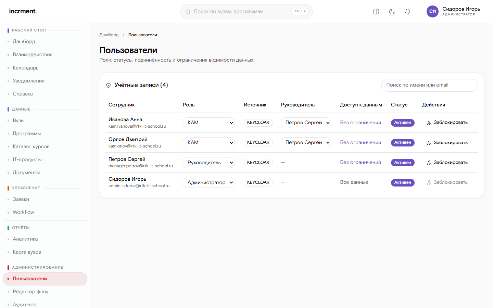
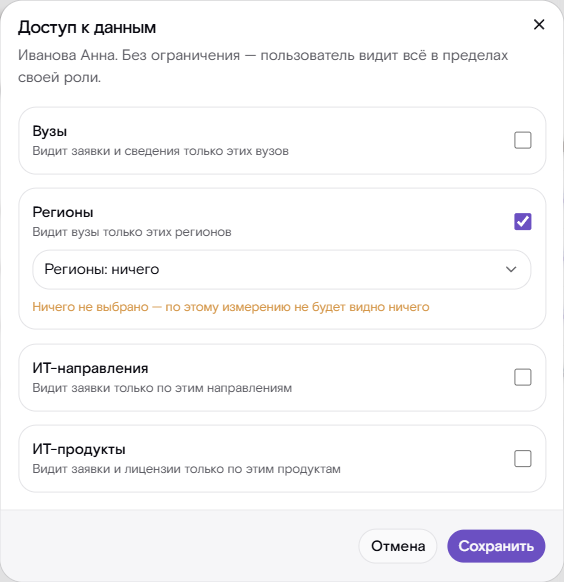

# Руководство администратора

Администратор отвечает за то, по каким правилам работает система: схему
процесса, права пользователей, настройки уведомлений и обмена с внешними
системами. Эти настройки общие для всех, поэтому большинство действий здесь
затрагивает работу всей команды сразу.

## Пользователи и права

Учётные записи заводятся в системе единого входа; здесь у пользователя
настраиваются роль, руководитель и ограничения видимости.

**Роль** определяет набор действий:

| Роль | Права |
|---|---|
| Пользователь (КАМ) | Работа со своими взаимодействиями |
| Руководитель | Плюс данные подчинённых и переназначение ответственного |
| Администратор | Плюс настройки, журнал действий и реестр персональных данных |

**Руководитель** задаёт иерархию: именно по ней руководитель видит заявки
подчинённых и получает напоминания об их задержках. Руководитель выбирается
в колонке «Руководитель» списка пользователей.

**Ограничения видимости** сужают доступ по вузам, направлениям, продуктам
и регионам. Настраиваются ссылкой в колонке «Доступ к данным»: по каждому
измерению — без ограничения либо список разрешённых значений. Пустой список
означает «не видно ничего», а не «без ограничения» — об этом диалог
предупреждает. Правила только сужают выборку, но никогда не расширяют её за
пределы роли.

 Ограничения по вузам и регионам не распространяются на прямые
продажи: у таких заявок вуза нет, и иначе они пропали бы из списка целиком.
Вуз, закрытый ограничением, недоступен и на своей странице: ни его
ответственных, ни договоров пользователь не увидит. Ограничение по продуктам
скрывает в договорах вуза лицензии на недоступные продукты.

Роль, назначенная здесь, действует до следующего решения администратора
и ролью из системы единого входа больше не перекрывается — в карточке
пользователя это видно по признаку «роль назначена в CRM». Пока роль
не назначали, она берётся из системы единого входа при каждом входе.
Понизить права скомпрометированной учётной записи можно сразу, не дожидаясь
правки в системе единого входа.

Блокировка действует немедленно: сеанс заблокированного пользователя
завершается, а открытые у него страницы перестают получать обновления.
Заявки заблокированного менеджера остаются видны его руководителю — чтобы
их можно было передать преемнику.

Себе роль понизить нельзя, и последнего администратора система удалить
не даст — иначе управлять ею станет некому.

## Схема процесса

Процесс в каждом сегменте един для всех, и его редакции не сосуществуют.
Это требование заказчика: разные версии маршрута у разных заявок создают
путаницу внутри подразделения.

Процесс можно пометить сайтом-источником (sz-rt, edu-rt, edupro) — так
отличаются, например, процесс федерального проекта и коммерческих программ.
Процессы sz-rt и edu-rt поставляются черновиками: действовать они начнут
только после публикации.

Порядок изменения:

1. **Черновик.** Действующая редакция не редактируется — правки вносятся
   в черновик следующей.
2. **Предварительный просмотр.** Покажет добавленные, переименованные
   и удаляемые статусы, число заявок в каждом удаляемом статусе и предложит,
   куда их перевести — в ближайший соседний статус. Там же видно, сколько
   заметок и файлов переедет вместе с заявками.
3. **Публикация.** Переводит на новую редакцию **все** текущие заявки сегмента.
   Для каждого удаляемого статуса, где есть заявки, нужно указать, куда их
   перенести; без подтверждения публикация не выполняется.

Каждый перенос попадает в историю заявки с пояснением — менеджер увидит смену
статуса, которую он не делал, и должен понимать её причину.

**Заметки и файлы переезжают вместе с заявкой.** Заявка, стоявшая в удалённом
статусе, переходит в выбранный — и её заметки и файлы этого этапа тоже: для неё
это по-прежнему текущий этап, и условие «приложите документ» нового статуса
учитывает уже приложенный файл. Подпись этапа у заметки остаётся прежней,
поэтому видно, где она была написана. Отдельно сопоставлять комментарии
не нужно: комментарии к переходам хранятся в истории вместе с названиями
статусов на момент перехода и от правки схемы не зависят.

Заявки, давно ушедшие с удаляемого этапа, не трогаются: их заметки на нём —
история. В карточке такой этап показывается в конце пути с пометкой, что его
больше нет в схеме.

Схема проверяется при сохранении: ровно одно начальное состояние, хотя бы одно
завершающее, все состояния достижимы, из завершающих переходов нет. У состояния
задаются норматив в днях, требование вложения и роли, которым доступен переход.

Прошлые редакции остаются в системе как журнал изменений: по ним видно, как
выглядела схема раньше. Опубликованная хоть раз редакция не правится
и повторно не публикуется — иначе журнал переписывался бы задним числом.
Чтобы вернуть прежнюю схему, создайте новый черновик с её определением.

Изменения норматива этапа и признака «завершающий» применяются и к заявкам,
которые уже стоят на этом этапе: срок пересчитывается от момента входа
в этап, а заявки на этапе, ставшем завершающим, считаются завершёнными.

## Уведомления

Настраиваются порог простоя и каналы доставки.

**Порог простоя** — через сколько дней стояния в одном статусе уходит
напоминание. Значение общее для системы; по умолчанию 14 дней.

**Каналы**: внутрисистемный работает всегда и отключению не подлежит — он
единственный не зависит от внешних сервисов. Telegram и MAX подключаются
токеном бота и идентификатором чата, почта — параметрами узла SMTP.
Сохранённые секреты — всё, в названии чего есть token, key, secret или pass, —
наружу не возвращаются: вместо значения показываются точки. Пустое поле
или те же точки при сохранении означают «оставить прежний токен».

Если токен бота сохраняли до этой правки через форму с точками, он мог быть
заменён самими точками: проверьте канал кнопкой проверки и при необходимости
введите токен заново.

Адрес сервера мессенджера в настройках канала не задаётся: он определяется
развёртыванием. Прежде его можно было поменять в форме — и тем самым отправить
сохранённый токен бота на чужой узел. Канал принимает только свои параметры:
для Telegram и MAX — `botToken` и `chatId`, для почты — `host`, `port`, `from`,
`user`, `smtpPassword`, `secure`; прочие ключи отклоняются с пояснением.

Кнопка проверки отправляет пробное сообщение и показывает результат. Если канал
недоступен — а в закрытом контуре это норма, — сообщение всё равно сохранится
внутри системы с пояснением, почему доставки не было.

Рассылка напоминаний о простое идёт по расписанию раз в сутки. Отдельная
команда запускает её немедленно — это удобно при проверке настройки и при показе.

Теми же каналами уходят уведомления календаря: напоминание о задаче в момент,
выбранный пользователем, задача, поставленная руководителем, и отметка
о её выполнении.

## Календарь и часовой пояс

Дни задач считаются в часовом поясе организации — по умолчанию московском
(переменная `APP_TIMEZONE`). Это важно для задач «на весь день»: такая задача
становится просроченной в полночь по местному времени, а не в три часа ночи,
как было бы по UTC. Интерфейс получает часовой пояс в ответе календаря.

Руководитель ставит задачи только своим подчинённым, администратор — любому
активному пользователю. Исполнитель поставленную ему задачу выполняет, но не
правит и не удаляет.

## Обмен с LMS и сайтом

Система обменивается данными с двумя системами ИТ Школы: LMS, где проходит
обучение, и сайтом, откуда приходят обращения.

**Входящее направление**: синхронизация по запросу или по расписанию, плюс
приём событий, которые внешняя система присылает сама. Входящие вызовы
подписываются общим секретом; без верной подписи событие отклоняется.

**Исходящее направление**: изменения по заявкам уходят во внешние системы
сообщением установленного контракта. Событие записывается в одной транзакции
с самим переходом и отправляется фоновым процессом, поэтому расхождений между
системами не возникает даже при сбое.

Полезные действия:

- **История прогонов** — сколько событий получено, создано, обновлено,
  пропущено как повторные и сколько не разобрано.
- **Сброс курсора** — заставляет систему перечитать события с начала.
  Дублей это не создаёт: применённые события опознаются по идентификатору.
- **Контракт обмена** — схема и пример сообщения; это то, что передаётся
  команде внешней системы при стыковке.

Пока контракт внешних систем не передан, рядом работает имитатор — отдельная
служба, которая ведёт себя как LMS и сайт. Переход на настоящие системы
выполняется сменой адресов в настройках развёртывания.

Без секрета подписи (`INTEGRATION_WEBHOOK_SECRET`) приём событий в рабочем
режиме закрыт — вызовы получают ответ «приём событий не настроен». Метку
из образца настроек система секретом не считает и с ней не запускается.

### Оплаты с сайта

Сайт присылает оплаты на отдельный адрес `/api/v1/integration/website/payments`
с той же подписью, что и события. Запись с ошибкой не принимается, но и
остальные из-за неё не теряются; в ответе сайту — итог по каждой записи.
Исходные записи (и принятые, и отклонённые) хранятся 30 дней для разбора
с командой сайта и стираются регламентной очисткой.

Курс в оплате сопоставляется с программой каталога **по названию**. Если
на сайте появился новый курс, заведите программу с тем же названием — иначе
оплаты по нему будут отклоняться с причиной «не найден в каталоге программ».

Шаблон загрузки в LMS повторяет файл заказчика, включая опечатки в заголовках
(«Отчествопри наличии)»): если загрузчик LMS сверяет заголовки по тексту,
исправленный файл он бы не принял. Паспорт, СНИЛС, адрес и диплом CRM
не собирает — эти колонки остаются пустыми.

## Журнал действий

Журнал фиксирует вход в систему, доступ к персональным данным, выгрузки,
работу с файлами, изменения прав и области видимости, правки процесса
и настроек.

Записи связаны хэш-цепочкой, а изменение записей запрещено на уровне базы
данных. Отдельная проверка подтверждает целостность цепочки: если запись
подменили или изъяли, это станет видно.

Персональные данные в журнале маскируются — журнал отвечает на вопрос
«кто и что сделал», а не хранит вторую копию данных.

Журнал действий не путать с **лентой действий** пользователей: лента — рабочий
инструмент менеджеров («что я менял по этой заявке»), доступна каждому в пределах
его заявок и сетевых реквизитов не содержит. Смена оценки заинтересованности,
правка карточки и переназначение попадают в оба: в ленту — для работы,
в журнал — для контроля.

## Персональные данные

Система обрабатывает минимальный состав: ФИО и рабочие контакты ответственных.
В реестре персон доступны:

- **правовое основание** обработки для каждой записи — его обязан предъявить
  оператор при проверке;
- **срок хранения**, по истечении которого запись обезличивается
  регламентной задачей;
- **обезличивание по требованию субъекта** — данные заменяются на отметку,
  а связи в истории сохраняются.

Ответственные от вуза и контакты вендоров, введённые вручную, связываются
с уже известной записью реестра только при совпадении ФИО. Почта, записанная
у другого человека, отклоняется без указания, у кого именно, — иначе по чужой
почте можно было бы узнать имя и телефон человека. Правка ответственного вуза
пишется в журнал действий с прежними и новыми значениями.

Заметки к заявкам — свободный текст, и персональные данные в них может внести
сам менеджер. Удалить чужую заметку может только администратор: из карточки
она пропадает, а в ленте действий остаётся лишь факт удаления, без текста.

Подробное сопоставление требований закона с реализацией — в отдельном
документе по защите информации.

## Обслуживание

| Задача | Периодичность | Что делает |
|---|---|---|
| Очистка по срокам хранения | Ежесуточно, ночью | Обезличивает просроченные ПДн (без явного срока — через `PERSONAL_DATA_RETENTION_DAYS` дней после последнего изменения записи), стирает содержимое сообщений внешних систем старше 30 дней, удаляет истёкшие отчёты и вложения |
| Напоминания о простое | Ежесуточно, утром | Рассылает уведомления по зависшим заявкам |
| Напоминания календаря | Каждую минуту | Отправляет наступившие напоминания о задачах |
| Отправка исходящих событий | Каждые полминуты | Доставляет накопленные сообщения внешним системам |
| Синхронизация с внешними системами | По расписанию либо вручную | Забирает события LMS и сайта |

Все регламентные задачи выполняются фоновым процессом и защищены блокировкой:
при нескольких копиях процесса работа не дублируется.

Состояние системы проверяется пробами готовности: недоступность базы выводит
экземпляр из обслуживания, недоступность кэша переводит его в ограниченный
режим, но работу не останавливает.
