# Руководство пользователя

Система ведёт взаимодействия ИТ Школы РТК с учебными заведениями и прямые
продажи обучения. Каждое взаимодействие проходит по процессу — от поиска
контактного лица до сопровождения, — и система следит, чтобы ни один шаг
не потерялся.

## Вход

Вход выполняется по учётной записи ИТ Школы через единую систему входа.
Отдельного пароля у системы нет: если учётная запись заблокирована, доступ
пропадает сразу и здесь.

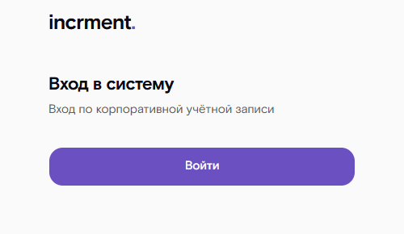

После входа открывается главный экран: заявки, с которыми вы работали
последние две недели, ближайшие задачи календаря и уведомления. Что вообще
доступно, зависит от роли:

| Роль | Что доступно |
|---|---|
| Менеджер (КАМ) | Свои взаимодействия |
| Руководитель | Свои и взаимодействия подчинённых, переназначение ответственного |
| Администратор | Все данные, настройки, журнал действий |

Если ожидаемой записи в списке нет, причина почти всегда в области видимости:
администратор мог ограничить доступ по вузам, направлениям, продуктам или
регионам. Список ограничений видно у администратора в карточке пользователя.

## Поиск

Строка поиска в шапке ищет сразу по вузам (название, сокращение, ИНН, город),
программам, взаимодействиям (вуз или контрагент, направление, продукт,
программа, ответственный) и продуктам. Достаточно начала слова: «каз» найдёт
КФУ и КНИТУ-КАИ, регистр, «ё» и кавычки не мешают. Стрелки выбирают
результат, Enter открывает его; перейти к поиску можно сочетанием Ctrl+K
или клавишей «/». Пока запрос пуст, под строкой видны недавно открытые
карточки. Выбранный продукт открывает список взаимодействий по нему,
последняя строка — все взаимодействия по запросу.

На узком экране поиск открывается кнопкой с лупой в шапке.

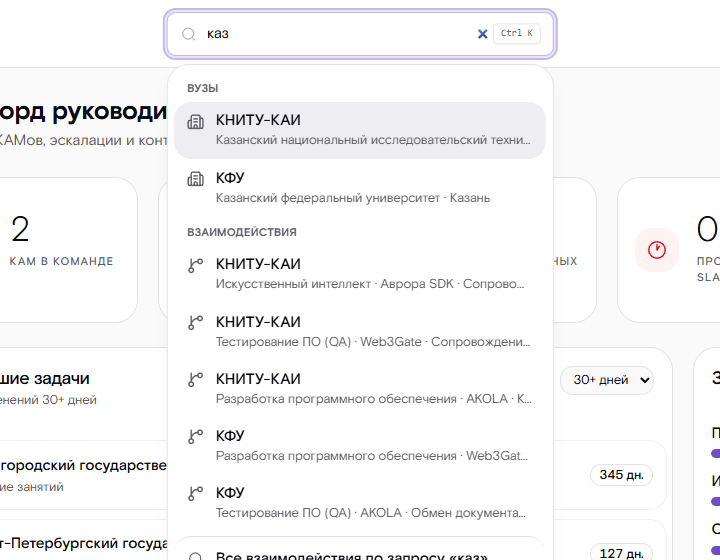

## Список взаимодействий

Взаимодействия разложены по этапам процесса: карточку можно перетащить
на следующий этап, и система попросит подтвердить переход с комментарием.
Переключатель B2B / B2C выбирает работу с вузами либо прямые продажи.

Над доской — отбор, как требует порядок работы с данными:

- **поиск** по вузу, направлению, продукту, программе и ответственному;
- **вуз, ответственный, направление, продукт, программа и статус**;
- **период** — заявки, заведённые в выбранные дни (границы включительно);
- **только просроченные** — заявки, которые стоят в статусе дольше норматива
  этого этапа.

«Показано N из M» подсказывает, сколько заявок скрыто отбором, а «Сбросить»
возвращает всё. Отбор сохраняется: при следующем входе, в том числе с другого
устройства, доска откроется с тем же отбором.

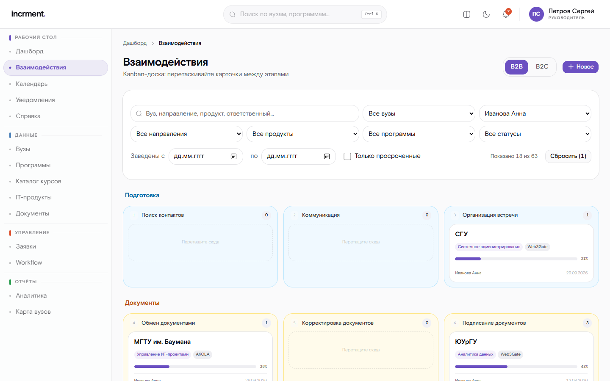

## Карточка взаимодействия

В карточке собрано всё по одной работе: контрагент, направление, продукт,
программа, ответственный, текущий статус, срок по нормативу, путь по этапам,
заметки, вложения, задачи и полная история.

Путь заявки показывает все этапы процесса по порядку. У каждого шага видно,
сколько к нему оставлено заметок и приложено файлов, — нажав на шаг, вы увидите
именно их.

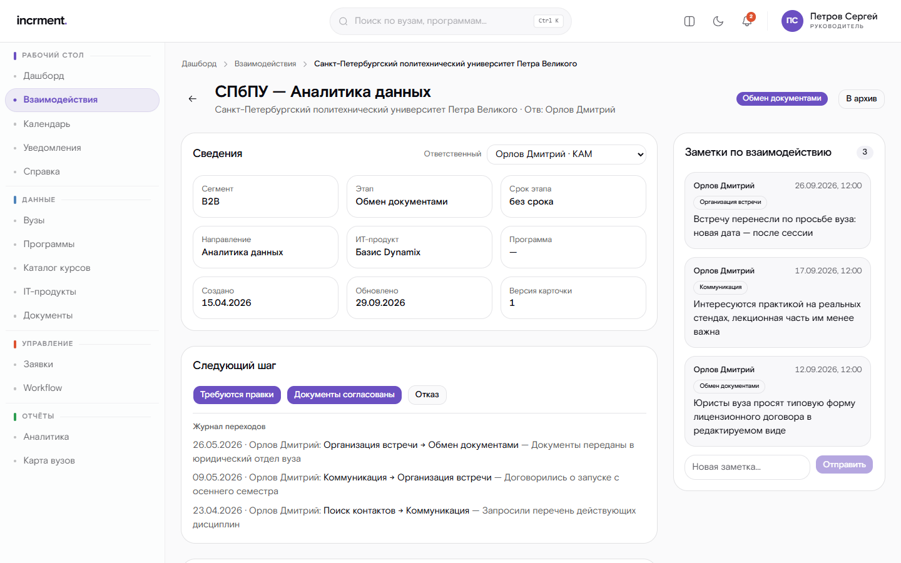

### Перевод в следующий статус

Кнопки переходов формируются по действующей схеме процесса, а не по фиксированному
списку. Недоступный переход виден вместе с причиной:

- «требуется комментарий» — переход обязывает пояснить решение;
- «приложите документ» — из текущего статуса нельзя выйти без вложения;
- «доступно ролям…» — например, отказ оформляет руководитель.

Если во время вашей работы статус изменил кто-то другой, система откажет
в переходе и предложит обновить карточку. Это не сбой: так изменения коллеги
не затираются молча.

### Заметки

Заметку можно оставить в любой момент, не меняя статуса: «проректор просит
прислать программу до пятницы», «договор только через юротдел». Комментарий
к переходу фиксирует решение, а заметка — ход работы, пока заявка стоит
на этапе.

- **К этапу.** По умолчанию заметка ложится на текущий этап. Можно выбрать
  и другой — например, дописать что-то к уже пройденной встрече.
- **Ко всей заявке.** То, что не относится ни к одному шагу: «ректор в отпуске
  до марта».
- **Закреплённые** заметки идут первыми. Закрепить может любой, кто видит
  карточку.
- **Править и удалять** заметку может её автор. Удалённая заметка пропадает
  из карточки; в истории остаётся только факт удаления, без текста.

Заметки только текстовые.

### Вложения

Принимаются png, jpeg, pdf, zip, gzip, rar, doc, docx, xls, xlsx. Каждый файл
проверяется антивирусом и по фактическому содержимому, а не по расширению.
Пока проверка не завершена, файл не выдаётся на скачивание.

Файл прикладывается к этапу — по умолчанию к текущему. Это важно для этапов,
с которых нельзя уйти без документа: условие выполняет только файл **этого**
этапа. Скан с первой встречи не пропустит заявку дальше подписания договора —
приложите сам договор.

### Заинтересованность

Оценка того, насколько контрагенту интересна программа: высокая, средняя или
низкая, с коротким обоснованием. Её ставит менеджер в карточке, и она видна
цветной меткой в списке и на странице вуза. Каждая смена оценки попадает
в историю вместе с прежним значением и причиной.

Из оценок складывается рейтинг заинтересованности по направлениям, продуктам,
программам и вузам: индекс от 0 до 100, где высокая оценка — 100, средняя — 50,
низкая — 0. Рядом всегда видно, сколько заявок ещё не оценено: высокий интерес
у одного вуза из двадцати — не то же самое, что у единственного оценённого.

### История

В карточке две истории.

**Журнал переходов** не редактируется: кто и когда перевёл заявку, с каким
комментарием. Там же появляются переходы, выполненные не человеком:

- «Получено от внешней системы…» — событие пришло из LMS или с сайта;
- «Автоматический перенос…» — администратор изменил схему процесса, и заявка
  переехала в соседний статус. Заметки и файлы этапа переезжают вместе с ней
  и сохраняют прежнюю подпись этапа.

**Полная история** — всё, что происходило с заявкой, кто бы это ни делал:
заметки, файлы, оценки, смена ответственного, задачи.

### Встречи

Встреча с представителями вуза — шаг «Организация встречи» базового процесса.
Нажмите «Назначить встречу» в карточке: дата, время, продолжительность, место
или ссылка, повестка и представители вуза — их выбирают из ответственных
от вуза на странице вуза. Сотрудником встречи по умолчанию становитесь вы.

Встреча видна в карточке, в полной истории заявки и в календаре участников.
После встречи нажмите «Встреча проведена» и запишите итоги: о чём договорились.
Несостоявшуюся встречу отмените — она не удаляется и остаётся в истории.
Изменить встречу могут её автор, ответственный по заявке и руководитель.

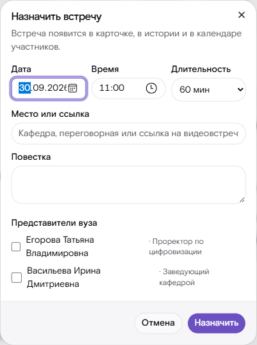

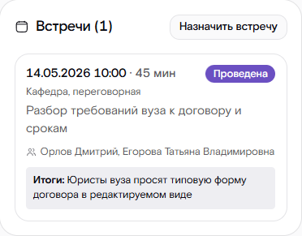

### Архив

Заявку, работа по которой окончена, уберите в архив — она пропадёт из списка
и не будет мешать. Завершённую заявку (обучение пройдено, отказ) отправляет
в архив и сам ответственный. Незавершённую — только руководитель и с указанием
причины: это решение прекратить работу.

Архивная заявка доступна только для чтения: переходы, правка, заметки, файлы
и задачи по ней недоступны, внешние системы её тоже не двигают. Найти её можно
отбором «показывать архивные». Если работа возобновилась, нажмите «Вернуть из
архива» — это может любой, кому заявка видна. Отправка в архив и возврат видны
в истории заявки вместе с причиной.

## Реестр вузов

Раздел «Вузы» — каталог учебных заведений. Поиск идёт по названию,
сокращению, ИНН и городу; отбор — по региону, а также по направлению
и ответственному (вуз попадает в выборку, если с ним есть такое
взаимодействие). Столбцы сортируются нажатием на заголовок. Руководитель
и администратор добавляют вуз кнопкой «Добавить вуз»: пока вводится
название, система показывает похожие записи, чтобы не завести дубликат.

## Страница вуза

На странице вуза, кроме заявок с ним, собраны:

- **Ответственные от вуза** — ФИО, телефон, почта, должность и роль
  («практика», «договоры»); основной контакт первым. Добавить человека или
  дописать недостающую почту может тот, у кого есть открытая заявка с этим
  вузом, и руководитель. Исправить уже сохранённые ФИО, почту или телефон и
  убрать человека из списка — руководитель. Если человек уже есть в списке
  (например, его завела загрузка таблицы одной фамилией), добавление с почтой
  дополнит его запись, а не создаст вторую.
- **Договоры и лицензии** — по каждой лицензии продукт, вендор, дата
  подписания, срок, действует ли она сегодня и статус передачи.
- **Потоки** — учебные группы по программам: сколько человек, когда старт,
  идёт поток, запланирован или завершён. «Обучается сейчас» считается только
  по идущим потокам.
- **Заметки по вузу** — то, что не относится ни к одной заявке: «сменился
  проректор», «закупки только через площадку». Их видят все, кому доступен
  вуз; рядом показаны заметки из карточек заявок этого вуза. Текст заметки
  правит только автор.

Потоки ранжируют программы по востребованности: на странице «Программы»
у каждой видно число заявок, обучающихся сейчас и параллельных потоков.

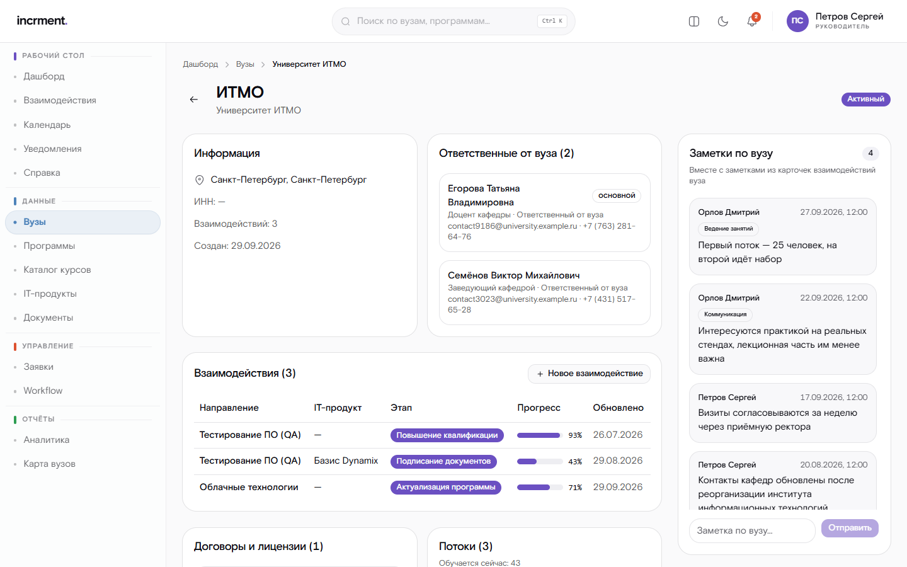

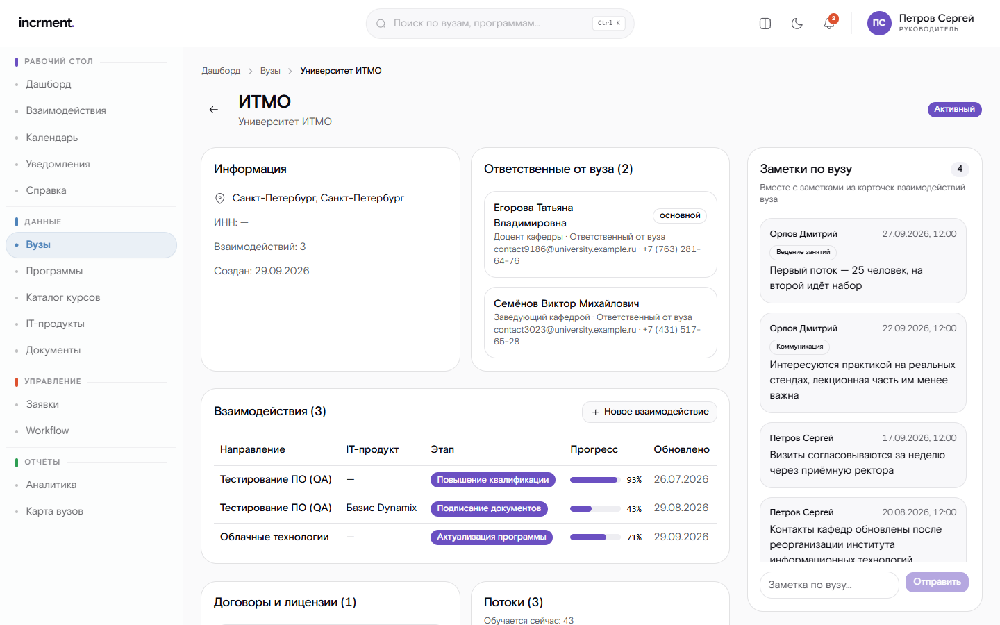

## Программы и каталог курсов

«Программы» ранжируют ИТ-программы по востребованности — по требованию ТЗ:
число заявок, обучающихся сейчас и параллельных потоков. Обучающиеся и потоки
считаются по потокам, которые идут сейчас: завершённый поток — уже выпуск,
запланированный — ещё набор.

«Каталог курсов» показывает программы всех образовательных проектов
(ИТ Школа РТК, edu-rt, sz-rt, edupro) с отбором по проекту, направлению, вузу,
продолжительности и аудитории. Нажатие на строку открывает карточку программы:
описание, для кого она, что нужно для зачисления, потоки.

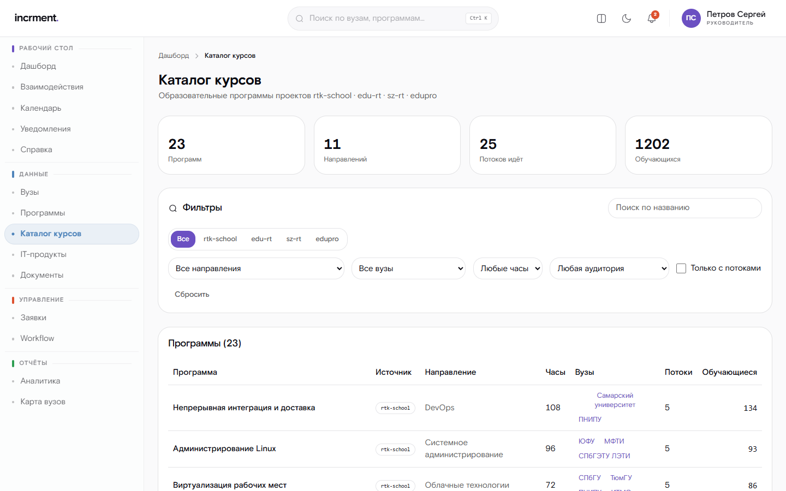

## Прямые продажи

Обучение продаётся и напрямую — физическим лицам и организациям. Такие заявки
идут по своему, более короткому процессу, и вуза у них нет: контрагент указан
в карточке напрямую. Отбор по сегменту разделяет эти два потока работы.

Заявка с сайта или запись на обучение в LMS попадает в систему сама. Повторные
события по тому же обращению не создают вторую заявку, а продвигают существующую.

### Оплата и передача в LMS

Когда слушатель оплачивает курс на сайте, система сама:

- находит его заявку (или заводит новую, если человек не оставлял обращения);
- ставит отметку об оплате, номер заказа и поток;
- переводит заявку на этап «Договор и оплата».

Отдельный документ об оплате прикладывать не нужно: подтверждение пришло
с сайта, и переход «Оплата подтверждена» доступен сразу.

Оплативших слушателей нужно передать в LMS. Откройте **«Выгрузка в LMS»**:
там список тех, кто оплатил и ещё не передан, — только ваши слушатели, у
руководителя — его подразделения. Отберите по программе или потоку и нажмите
«Выгрузить»: получится файл по шаблону LMS (фамилия, имя, отчество, телефон,
почта). Слушатель без почты помечен и в файл не попадёт — узнайте почту у слушателя,
впишите её в карточке заявки («Контакт» → «Дописать почту») и выгрузите его отдельно.
Уже указанную почту менеджер не меняет — исправление делает администратор. Выгруженные из списка пропадают, повторно в файл
не попадут; если загрузка в LMS не удалась, выгрузите их снова с отметкой
«включая уже выгруженных».

Когда LMS заведёт учётную запись, заявка сама перейдёт в «Доступ выдан».

## Что я делал: лента действий

Лента показывает ваши собственные действия: смены статусов, заметки, файлы,
оценки, задачи — новые сверху, с отбором по периоду и виду действия.
Вернувшись к вузу через месяц, по ней легко восстановить, на чём остановились.

Действия коллег в вашей ленте не появляются — они видны в истории конкретной
заявки. События по заявкам, которые у вас больше не на ведении, из ленты
пропадают вместе с доступом к самим заявкам.

На главном экране та же лента собрана по заявкам: с чем вы работали за
последние дни и что делали последним. Карточка открывается одним нажатием.

## Календарь

В календаре собраны задачи, сроки этапов и встречи с вузами.

Задача — дело с датой: «позвонить на кафедру», «отправить договор в юротдел».

- **На день или на время.** Задача на весь день становится просроченной
  с полуночи следующего дня, задача на время — с наступлением этого времени.
  Время указывается московское (часовой пояс организации).
- **Привязка к заявке** — необязательна; привязанная задача видна и в карточке.
- **Напоминание** приходит уведомлением в выбранный момент — внутри системы
  и в подключённые мессенджеры.
- **Сроки этапов** появляются в календаре сами: заявка, вошедшая в этап
  с нормативом, отмечается в день, когда норматив истекает. Дублировать
  их задачами не нужно.
- **Встречи** видны тем, кто в них участвует, и ответственному по заявке.
  Отменённые встречи в календарь не попадают.

**Поручения.** Руководитель может поставить задачу подчинённому — тот получит
уведомление. Поручение исполнитель отмечает выполненным, но не меняет и не
удаляет; о выполнении руководитель узнает уведомлением. Руководителю доступен
и календарь сроков по заявкам всего отдела.

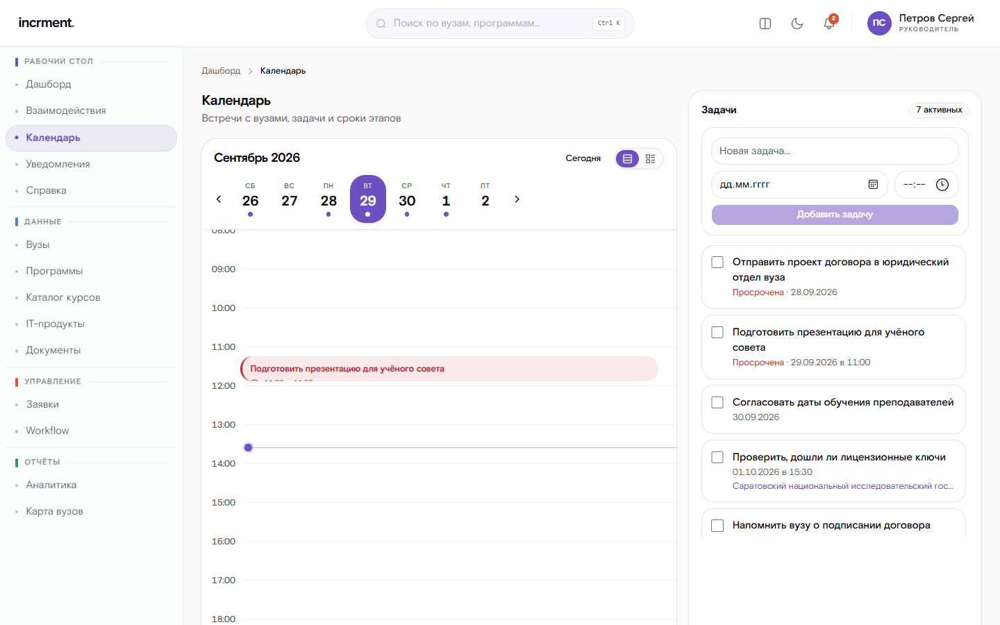

## Загрузка данных из таблицы

Каталоги и взаимодействия загружаются из файла Excel. Принимаются оба формата —
современный xlsx и книги 97-2003; формат определяется по содержимому файла,
поэтому переименовывать ничего не нужно.

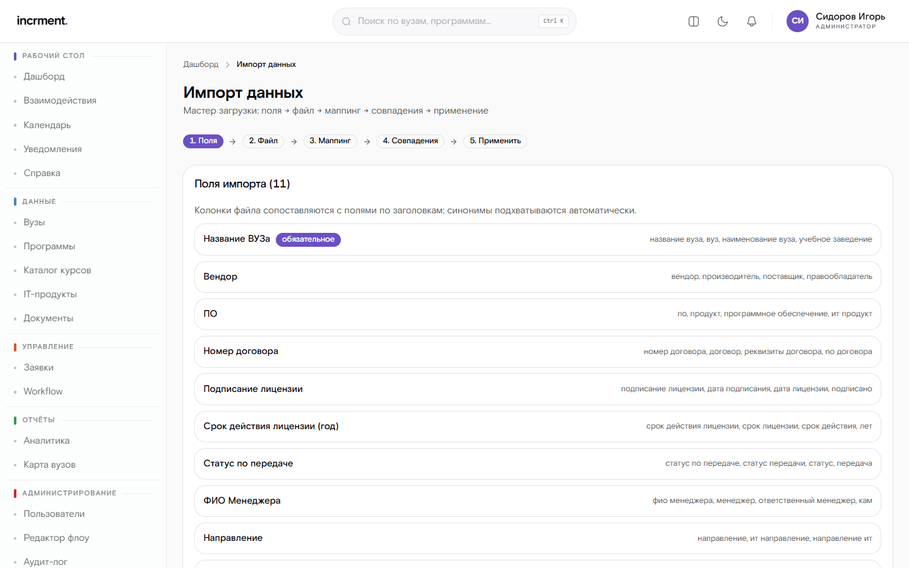

Порядок работы:

1. **Загрузите файл.** Система разберёт его в фоне.
2. **Проверьте сопоставление колонок.** Заголовки распознаются по синонимам
   («ВУЗ», «Название ВУЗа», «Учебное заведение» — одно и то же), но последнее
   слово за вами. Колонки, которых в системе нет, показываются отдельно.
3. **Разберите ошибочные строки.** Для каждой указаны номер строки, колонка
   и причина.
4. **Разрешите спорные совпадения.** Если вуз в файле похож на уже заведённый,
   система спросит, это тот же вуз или новый.
5. **Подтвердите импорт.** До подтверждения в базе ничего не меняется.

Компания в таблице узнаётся и без правовой формы: «Ростелеком», «ПАО Ростелеком»
и «ПАО «Ростелеком»» — один вендор, второй не заведётся.

**Колонка «ФИО менеджера».** Если она есть, по каждой паре «вуз — продукт»
заводится заявка, и ответственным становится названный сотрудник. Писать можно
полностью или с инициалами: «Иванова Анна Сергеевна» и «Иванова А.С.» — один
человек. Руководитель поручает заявки себе и своим подчинённым, администратор —
любому. Если сотрудник не найден, заблокирован, не в вашем подчинении или
фамилия подходит нескольким, заявка заводится на вас — сводка предупредит об
этом до подтверждения, а передать её можно переназначением.

Направление заявки берётся из колонки «Направление»; без неё — из программ
продукта, если направление у них одно. Иначе строка загрузится без заявки,
с предупреждением. Если по вузу и продукту уже есть открытая заявка, новая не
заводится и ответственный не меняется: повторная загрузка того же файла заявок
не множит.

### Каталог вендоров и оплаты

Руководитель и администратор загружают ещё два вида файлов — оба сразу
показывают, что произойдёт, и ничего не меняют до подтверждения:

- **Каталог вендоров** — таблица «Компания, Продукт, ФИО, Телефон, Почта,
  Способ связи». Несколько продуктов в одной ячейке, телефон в любом виде,
  способ связи словами («Почта, Чат в ТГ») — всё это разбирается.
- **Оплаты** — выгрузка сайта (JSON) или таблица с теми же колонками. По каждой
  записи видно, что с ней будет: новая заявка, отметка в существующей, уже
  учтена или отклонена — и почему. Записи с предупреждениями (опечатка в
  курсе, странный номер заказа, нет почты) принимаются, но их стоит проверить.

## Отчёты

Отчёт строится в разделе «Аналитика» по всем взаимодействиям, которые вам
видны. Порядок:

1. **Отбор.** Период (заявки, заведённые с … по …), сегмент, вузы, направления,
   продукты, программы, ответственные и статусы; при необходимости — только
   просроченные или вместе с архивом. Ничего не выбрано — отбора нет.
   Под отбором сразу видно, сколько взаимодействий в него попадает.
2. **Колонки.** Отметьте, что должно попасть в таблицу: наименование вуза,
   ИТ-направление, ИТ-продукт, статус работы, ответственный и другие.
3. **Формат** — xlsx, xls (для старых систем), pdf или csv — и «Сформировать
   и скачать».

Выбранные отбор, колонки и формат запоминаются до следующего раза.

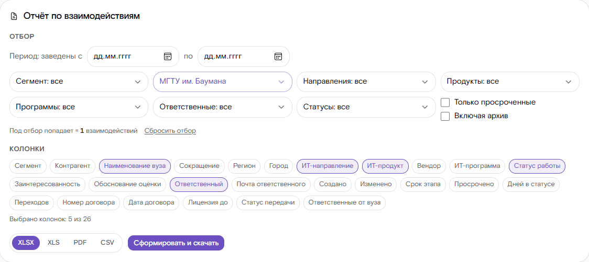

Небольшой отчёт приходит сразу файлом. Объёмный ставится в очередь: вы получаете
задачу и следите за ходом — по готовности появляется ссылка на скачивание.
Ограничения форматов: pdf собирается не более чем для 5000 строк, книга
97-2003 — не более 65 536 строк. При превышении система предложит другой формат.

Готовые файлы хранятся ограниченное время и затем удаляются — это требование
к обращению с персональными данными, а не экономия места.

**Диаграммы.** Ранжирование программ, региональная аналитика и воронка
взаимодействий выгружаются кнопками PNG и PDF в заголовке каждой диаграммы.
Файл строится по тем же данным, что на экране, на белом фоне и с датой
формирования — его можно сразу вставить в презентацию или отправить.

**Региональная аналитика** — карта России, где регион тем насыщеннее, чем
больше у него выбранный показатель: вузов, взаимодействий, обучающихся сейчас
или просроченных заявок. Легенда показывает диапазоны каждой ступени, нажатие
на регион открывает его вузы и сводку. Под картой — таблица регионов по тому
же показателю. Та же карта открывается отдельно пунктом «Карта вузов» в меню.

## Уведомления

Уведомления приходят в систему и, если администратор настроил каналы, в
мессенджер или почту.

Поводы:

- **заявка стоит без движения** дольше установленного срока — напоминание
  приходит ответственному и его руководителю;
- **статус вашей заявки изменил кто-то другой**;
- **напоминание о задаче** календаря в назначенный момент;
- **поручение руководителя** и отметка о его выполнении.

Счётчик непрочитанных обновляется сразу, без перезагрузки страницы.

## Если что-то пошло не так

| Что видите | Что произошло | Что делать |
|---|---|---|
| «Карточка изменена другим пользователем» | Кто-то опередил вас с переходом | Обновите карточку и повторите |
| «Требуется комментарий» / «Приложите документ» | Условие перехода не выполнено | Заполните недостающее. Документ должен быть приложен к текущему этапу |
| «Этап не найден в процессе» | Заметку или файл привязывают к этапу, которого в схеме нет | Выберите этап из пути заявки |
| «Карточка изменена другим пользователем» при правке оценки | Кто-то изменил карточку, пока она была открыта | Обновите карточку и повторите |
| «Задачу поставил руководитель…» | Поручение нельзя править и удалять | Отметьте выполненной либо обратитесь к руководителю |
| «Заявка в архиве» | Архивная заявка доступна только для чтения | Верните её из архива, если работа продолжается |
| «Ответственных вуза дополняет тот, кто ведёт с ним заявку…» | У вас нет открытой заявки с этим вузом | Обратитесь к руководителю |
| «Взаимодействие не найдено» | Записи нет либо она вне вашей области видимости | Уточните у администратора |
| «Превышена частота обращений» | Слишком много запросов подряд | Повторите через минуту |

В каждом сообщении об ошибке есть код вида `CRM-XXX-0000` и идентификатор
обращения. Назовите их администратору — по ним событие находится в журнале.
